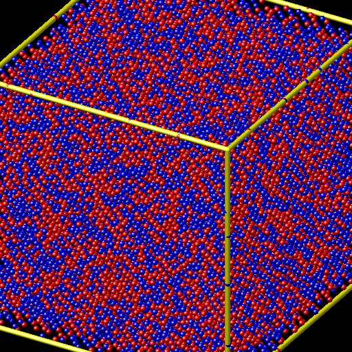
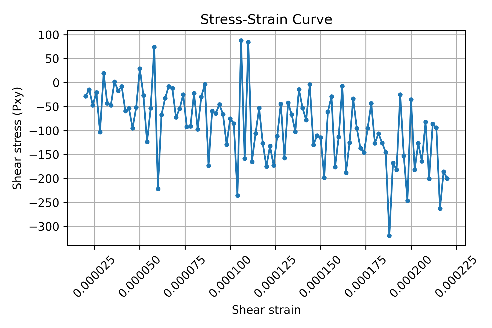

# FCC Dislocation Analysis: Copper Shear Simulation


*Figure 1: Visualization of internal stress in the copper crystal during shearing. Red atoms indicate high stress (potential defects).*

## Project Overview
This project simulates the mechanical deformation of **Copper (Cu)** at the atomic scale using Molecular Dynamics (MD).

By applying a shearing force to a crystal, we can observe:
1.  **Elastic Deformation**: How the metal stretches initially.
2.  **Yield Limit**: The maximum strength before it breaks.
3.  **Plastic Deformation**: How atoms slip past each other (dislocations) to permanently change shape.

## Key Results
The simulation outputs two main forms of data:

### 1. Mechanical Strength (Stress-Strain Curve)
We calculate the mechanical response of the material. The peak of this graph represents the sheer strength of the copper sample.



### 2. Defect Visualization
LAMMPS generates snapshots of the atoms colored by their **Shear Stress**:
*   **Blue Atoms**: Low Stress (Perfect Crystal/Elastic region).
*   **Red Atoms**: High Stress (Dislocations/Defects).

## How to Run (Windows / LAMMPS GUI)

This project is designed to be easy to run with **LAMMPS GUI** and **Python**.

### Prerequisites
*   **LAMMPS**: [Download for Windows](https://www.lammps.org/download.html#windows)
*   **Python 3**: [Download Python](https://www.python.org/downloads/) (Make sure "Add to PATH" is checked)

### Step 1: Run the Simulation
1.  Open **LAMMPS GUI**.
2.  Click **"File" -> "Open"** (or Load Script) and select `in.shear`.
3.  Click the **Run** (Play) button.
    *   *Result:* This will create a `log.lammps` file and generate images in the `figures/` folder.

### Step 2: Analyze the Data
1.  Open a terminal (Command Prompt or PowerShell) in this folder.
2.  Run the analysis script:
    ```cmd
    python postprocess.py --log log.lammps
    ```
    *   *Result:* This creates `figures/stress_strain.png` and `figures/stress_strain.csv`.

## Files in this Repository
*   `in.shear`: The main LAMMPS simulation script.
*   `postprocess.py`: Python script to read the log and plot the graph.
*   `potentials/`: Contains the Physics model for Copper (EAM alloy).
*   `figures/`: Generated output (Images and Graphs).
